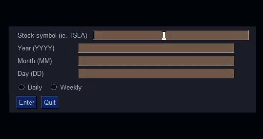

# Stock-Simple-Visualizer
Prototype of a stock analysis application. Pulls from the *Alpha Vantage API* and utilizes *PySimpleGUI* to receive user input. Continuously 
takes user input from given stock symbol, date, and outputs based on daily (averaged throughout the week) or weekly data (in progreess). 
In this simple version, basic error handling is considered for incorrect dates, symbols, or overflow. API key required to use.



For future updates (TO-DO):
```
- Complete weekly data values. 
- Additional error handling for more situations.
- Interactive graph data.
- Interactive calculator from Open, Close, Low, High.
- Choose time-frame.
- Choose single day data.
- Web support (PySimpleGUIWeb)
```

Alpha Vantage Documentation:
https://www.alphavantage.co/documentation/

PySimpleGUI Documentation:
https://pysimplegui.readthedocs.io/en/latest/
